<!-- <p align="center">
  
</p> -->

<h1 align="center"> Nex.Lab - Totem Foto </h1>

<p align="center">
  <a href="https://github.com/mayconcoutinhodev/totem-foto/actions">
    
  </a>
</p>

<a id="Sumário"></a>

<p align="center">
  <b> Sistema de Captura e Gerenciamento de Fotos para Eventos </b><br/>
  <sub> Plataforma integrada para captura via totem, processamento em tempo real e painel administrativo. </sub>
</p>

[](#table-of-contents)

<p align="center">
  <a href="#Introdução"> 🧩 Introdução </a>&nbsp;&nbsp;&nbsp;|&nbsp;&nbsp;&nbsp;
  <a href="#Resultados"> 🚀 Qualidade e CI/CD</a>&nbsp;&nbsp;&nbsp;|&nbsp;&nbsp;&nbsp;
  <a href="#Dependências"> 🧪 Dependências</a>&nbsp;&nbsp;&nbsp;|&nbsp;&nbsp;&nbsp;
  <a href="#Fluxo"> 🧭 Fluxo do Sistema</a>&nbsp;&nbsp;&nbsp;|&nbsp;&nbsp;&nbsp;
  <a href="#Configuração"> ⚙️ Configuração </a>&nbsp;&nbsp;&nbsp;|&nbsp;&nbsp;&nbsp;
  <a href="#Creditos"> 🏆 Créditos </a>
</p>

<br/>

<a id="Introdução"></a>
## 🧩 Introdução 

***⠀⠀⠀⠀Bem-vindo ao Nex.Lab Totem! Este projeto foi desenvolvido para oferecer uma experiência imersiva de captura de fotos em eventos. Com uma estética Cyberpunk e foco em performance, o sistema permite o gerenciamento completo desde a captura no hardware até a disponibilização via QR Code e gestão administrativa dos arquivos.***

<br/>


# 📸 Nex.Lab - Totem Foto

Sistema completo de captura, processamento e gerenciamento de fotos para eventos, focado em alta performance e experiência do usuário (UX).

---

## 🚀 Fluxo do Usuário (Totem)

Abaixo, a sequência de telas que o usuário interage durante a experiência no totem físico.

### 1. Início e Boas-Vindas
Interface inicial de recepção e standby do totem.
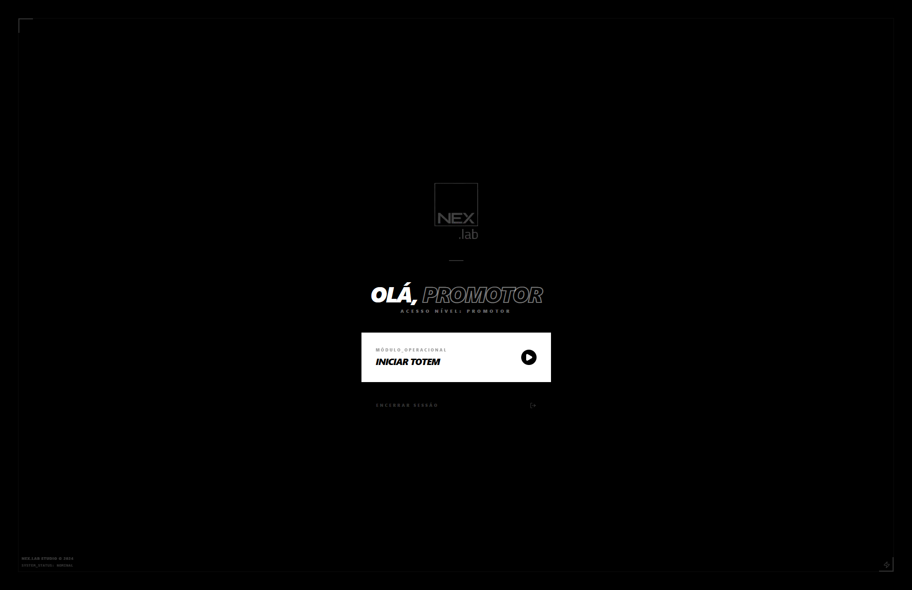

### 2. Tela Principal (Home)
Ponto de partida para iniciar a experiência de fotos.
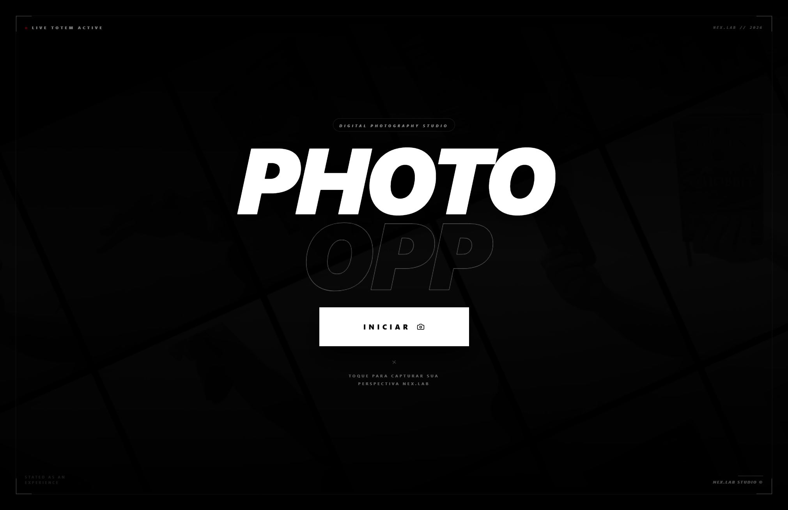

### 3. Captura de Foto
Interface de contagem regressiva e captura em tempo real.
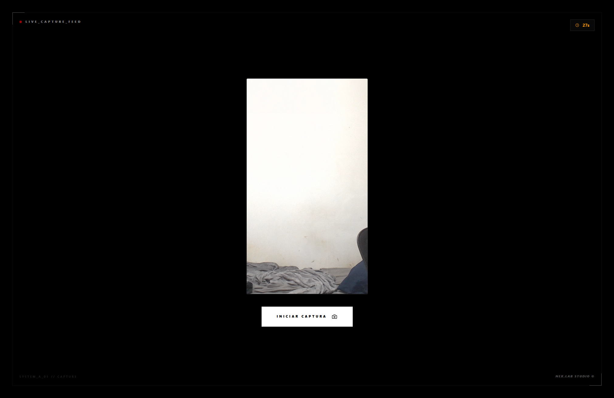

### 4. Review da Imagem
Momento onde o usuário visualiza a foto tirada antes de prosseguir.
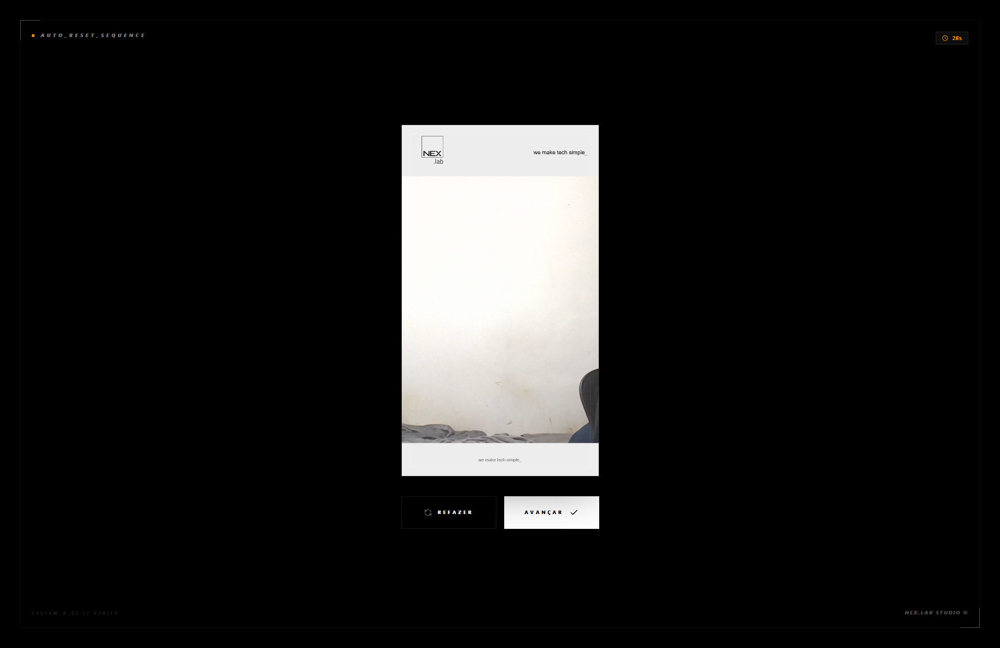

### 5. Download e Link via Celular
Geração de QR Code e interface para baixar a imagem direto no smartphone.
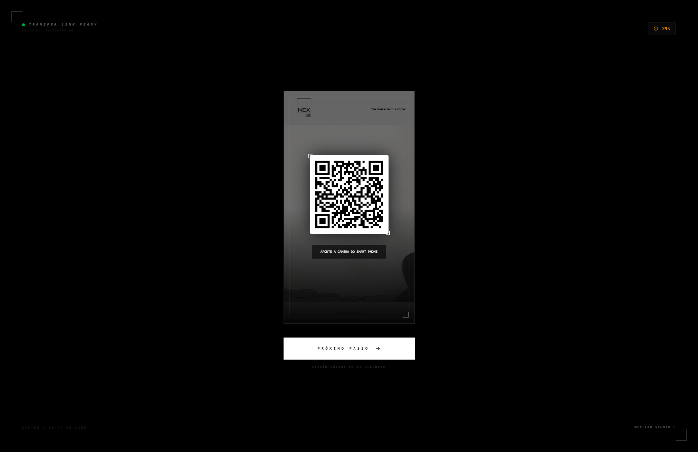
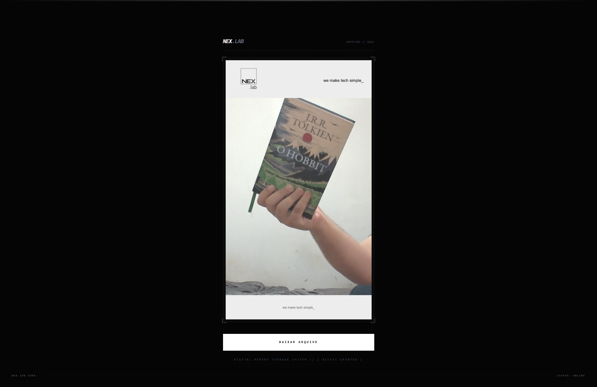

### 6. Finalização
Tela de encerramento do ciclo de uso.
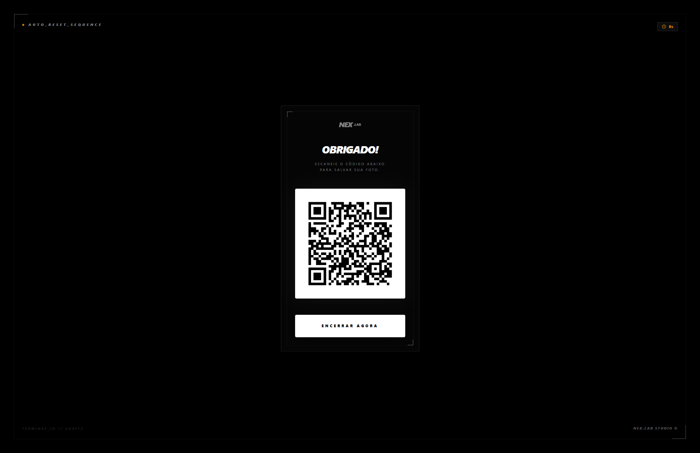

---

## 🔐 Área Administrativa e Segurança

Telas destinadas ao controle operacional e gerenciamento de dados.

### Portal de Login
Acesso restrito para administradores e promotores.
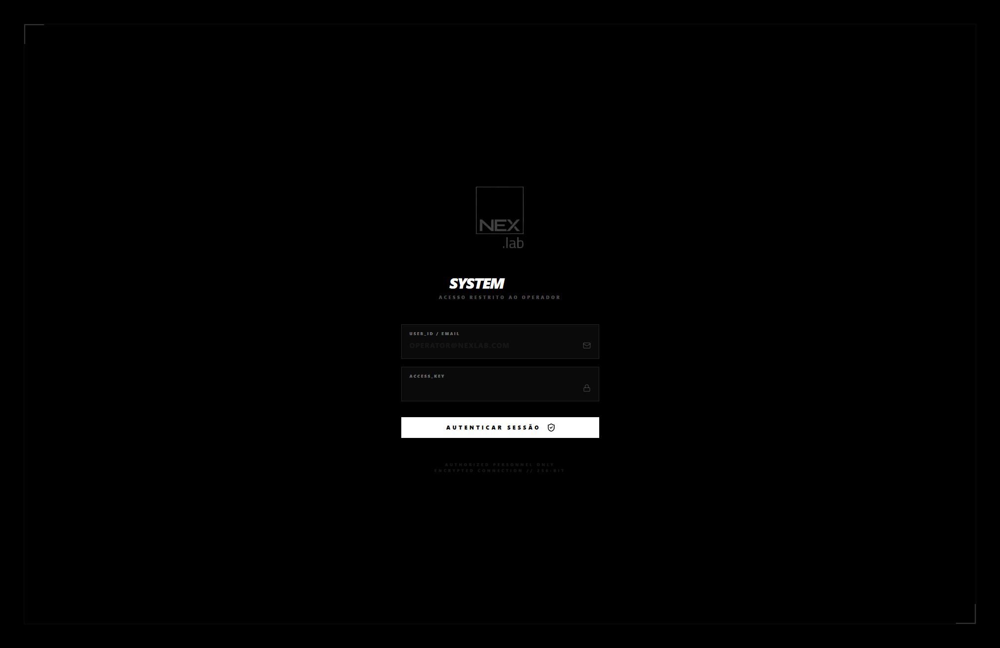

### Dashboard e Boas-Vindas Admin
Visão inicial do painel de controle.
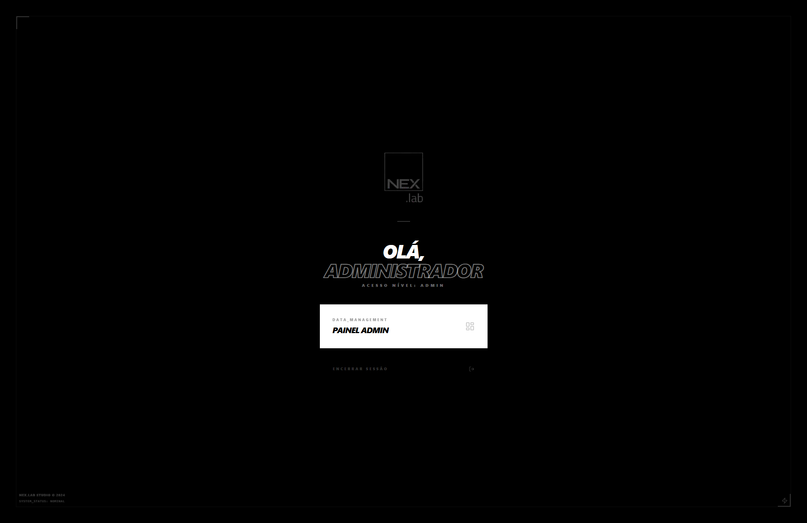

### Gerenciamento de Imagens (Tabela)
Listagem completa de todos os registros capturados pelo sistema.
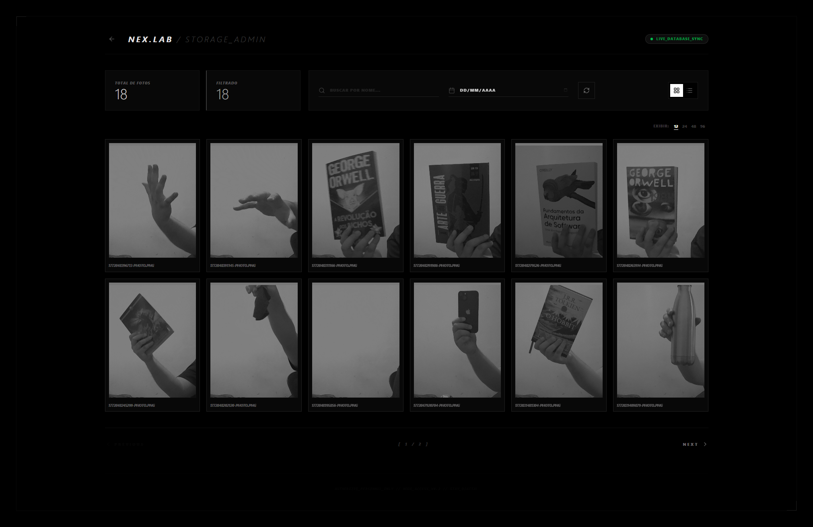

### Modal de Detalhes
Visualização expandida e ações específicas sobre as imagens no painel.
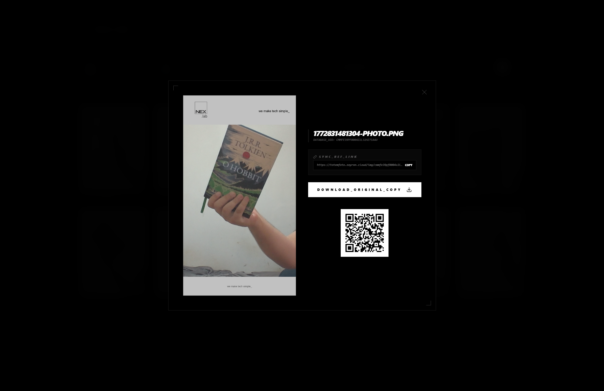

---

## 🛠️ Detalhes do Projeto

- **Arquitetura:** Next.js (App Router)
- **Estilização:** Tailwind CSS
- **Local das Imagens:** `docs/screenshots/`
- **Desenvolvido por:** Maycon Coutinho

---


<a id="Resultados"></a>
## 🚀 Qualidade e CI/CD

> O projeto implementa uma suíte rigorosa de testes Automatizados para garantir estabilidade visual e funcional.


* **Playwright E2E:** Testes de ponta a ponta simulando a jornada do usuário (Captura, Review, Download).
* **GitHub Actions:** Pipeline de CI configurado para validar cada commit automaticamente, garantindo que o ambiente (Prisma, NextAuth) esteja íntegro.
* **Hardware Mocking:** Testes configurados para simular fluxos de câmera e permissões de navegador em servidores remotos.

<br/> 

<a id="Fluxo"></a>
## 🧭 Fluxo do Sistema

<br/>

### 🎯 Totem (Client-Side)
 
O fluxo operacional do totem garante agilidade no atendimento:
1. **Autenticação:** Login do promotor responsável.
2. **Captura:** Interface de vídeo com simulação de hardware.
3. **Download:** Geração de QR Code dinâmico apontando para o storage local/nuvem.

<br/>

### 🎯 Admin Dashboard (Management)

Interface para gestão de arquivos e auditoria de capturas.

### ```GET``` 
http://localhost:3000/admin

<br />

### 🎯 Busca e Filtros

### ```SEARCH``` 

http://localhost:3000/admin?searchTerm={NOME_DO_ARQUIVO}


<a id="Dependências"></a>


### 🧪 Dependências e Tech Stack

```Bash

- Next.js 14 (App Router & Server Actions)
- Prisma ORM (Gestão de Banco de Dados)
- Next-Auth (Segurança e Sessões)
- Tailwind CSS (Estilização Cyberpunk)
- Playwright (Automação de Testes)
- Lucide React (Iconografia)
```

<a id="Configuração"></a>


### ⚙️ Configuração Local

> Para rodar o projeto e os testes em sua máquina:

Instale as dependências:


```Bash

npm install 

```

Configure o Prisma:

```Bash

npx prisma generate
npx prisma db push

# Popular o banco de dados com dados iniciais (Seed)
npx prisma db seed

```

Inicie os testes:

```Bash

# Modo Interface (Visual)
npx playwright test --ui

# Modo Headless (Terminal)
npx playwright test
```


<a id="Configuracao-Env"></a>
## ⚙️ Exemplo de Variáveis de Ambiente (.env.example)

> Este projeto utiliza as seguintes variáveis para funcionamento do Banco de Dados e Autenticação.

### ```ENV``` 

```bash
# BANCO DE DADOS (Prisma)
DATABASE_URL="file:./dev.db"

# NEXT AUTH (Segurança)
# Chave secreta para criptografia de tokens
NEXTAUTH_SECRET="sua_chave_secreta_aqui"
NEXTAUTH_URL="http://localhost:3000"

# CONFIGURAÇÕES GERAIS
NEXT_PUBLIC_API_URL="http://localhost:3000"

```
<a id="Creditos"></a>

### 🏆 Créditos
⠀
> Projeto desenvolvido por Maycon Coutinho como parte do ecossistema de soluções para eventos Nex.Lab.

<p align="center">
<a href="#Sumário"> 📖 Volta ao Sumário </a>
</p>


